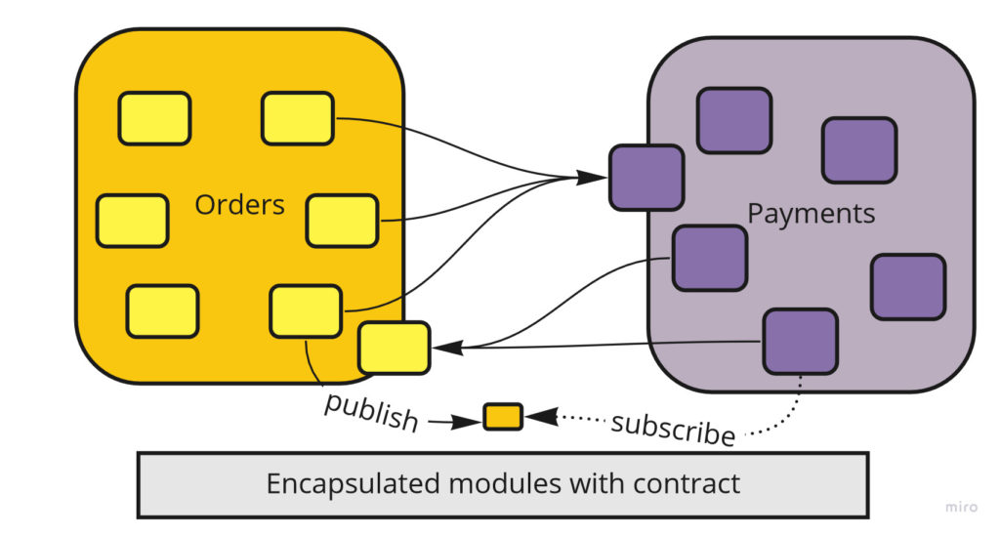
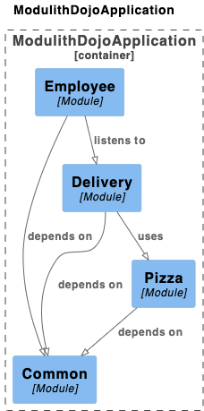

<!-- _class: lead --> 
# Bob's Pizza: A Modular Monolith Journey 🍕
 Using Spring Modulith to Build Better Systems

---

<!-- paginate: true -->
# Architecture Evolution

## Monoliths

A monolithic architecture is the traditional unified model where the entire application is one deployment unit.

<div class="columns">
<div>

* ### ✅ Advantages
  - Easy deployment & testing
  - Simple CI/CD workflow
  - Strong data consistency
  - Fast communication
  - Lower operational complexity
</div>

<div>

* ### ❌ Disadvantages
  - Hard to maintain at scale
  - Tight coupling
  - All-or-nothing scaling
  - Technology stack lock-in
  - Team bottlenecks
</div>
</div>

---

# Architecture Evolution
## Microservices

Independent, loosely coupled services that work together to form a complete application.

<div class="columns">
<div>

* ### ✅ Advantages
  - Independent deployments
  - Technology diversity
  - Granular scaling
  - Team autonomy
  - Better fault isolation
</div>

<div>

* ### ❌ Disadvantages
  - Operational complexity
  - Distributed system challenges
  - Data consistency issues
  - Complex testing
  - Higher infrastructure costs
</div>
</div>

---

# Architecture Evolution
## Enter The Modular Monolith - Modulith

Best of both worlds - single deployment unit with clear internal boundaries.

<div class="columns">
<div>

* ### ✅ Advantages
  - Clear module boundaries
  - Simple operations
  - Easier testing
  - Team autonomy within modules

  * Natural path to microservices
</div>

<div>

* ### ❌ Disadvantages
  - Requires discipline
  - Be careful boundary design
  - Risk of coupling
  - Single-unit scaling
  - Shared deployment
</div>
</div>

---

# Package by Feature

## Traditional vs Feature-based Organization

<div class="columns">
<div>

### Package by Layer ❌
```
com.pizza
  ├── controllers/
  │   ├── OrderController
  │   ├── MenuController
  ├── services/
  │   ├── OrderService
  │   ├── MenuService
  ├── repositories/
  │   ├── OrderRepository
  │   ├── MenuRepository
```
</div>

<div>

### Package by Feature ✅
```
com.pizza
  ├── order/
  │   ├── api/
  │   ├── domain/
  │   ├── infrastructure/
  ├── menu/
  │   ├── api/
  │   ├── domain/
  │   ├── infrastructure/
```
</div>
</div>

---

# Module Encapsulation

## Strong Boundaries Through Contracts

<div class="columns">
<div>

### Module Structure
```
com.pizza.order          # Module root
  ├── OrderApi           # Public contract
  ├── OrderDto           
  ├── domain/            # Hidden implementation
  │   ├── Order
  │   ├── OrderService
  ├── infrastructure/    # Hidden implementation
  │   ├── OrderRepo
  │   ├── OrderConfig
```
</div>

<div>

### Key Principles
- Public contracts at module root
- Implementation in domain/infrastructure
- Clear package boundaries
- Explicit dependencies
</div>
</div>

---

# Clean Integration Through Contracts 

### Integration Patterns
- Public API (Facades)
  - Direct, synchronous calls
  - Clear contracts via DTOs
- Events
  - Loose coupling
  - Async communication
- Shared Kernel
  - Common domain concepts
  - Shared between modules

<!-- _footer: Source: https://www.kamilgrzybek.com/blog/posts/modular-monolith-primer -->

---

# Spring Modulith

<div class="columns">
<div>

## Key Features
- Module isolation
- Event-driven communication
- Application Events
- Module API contracts
- Testing support
- Documentation

</div>

<div style="display: flex; justify-content: center; align-items: center;">

</div>
</div>

---

# Spring Modulith
## Module Enforcement

<div class="columns">
<div>

### Package Rules
```java
@org.springframework.modulith.Module
package com.pizza.order;
```
- Enforces package boundaries
- Prevents unauthorized access
- Validates dependencies
- Compile-time checks
</div>

<div>

### Violations Example
```java
package com.pizza.order.service;

// ❌ Illegal access to internal package
import com.pizza.menu.domain.MenuItem;

// ✅ Legal access through public API
import com.pizza.menu.MenuApi;
```
</div>
</div>

---

# Spring Modulith
## Event Support

<div class="columns">
<div>

### Publishing Events
```java
@TransactionalEventListener
void on(OrderCreatedEvent event) {
    // Handle synchronously
}

@Async
@TransactionalEventListener
void on(OrderUpdatedEvent event) {
    // Handle asynchronously
}
```
</div>

<div>

### Event Types
- Application Events
- Domain Events
- Integration Events
- Supports async/sync
- Transaction bound
- Custom publication
</div>
</div>

---

# Spring Modulith
## Moments - Passage of Time Events

<div class="columns">
<div>

### Time as Domain Events
```java
@Async
@TransactionalEventListener
void on(MonthHasPassed event) {
  // Handle Event at the end of every month
}
```

</div>

<div>

### Key Benefits
- Time becomes a domain event
- Decoupled from scheduling
- Perfect for event sourcing
- Easy to test time-based logic
- Reactive approach

</div>
</div>

---

# Demo Project: Bob's Pizza

## Overview
- Pizza ordering system
- Three core modules:
  - **Pizza Menu & Management**
  - **Employee Management**
  - **Delivery Tracking**
- Clean module boundaries
- Event-driven updates

---

# Module Structure

<div class="columns">
<div>

## Pizza Module
- Menu management
- Pricing
- Order statistics

</div>

<div>

## Employee Module
- Staff management
- Task tracking
- Department organization

</div>

<div>

## Delivery Module
- Order tracking
- Status updates
- Customer information
</div>

</div>

---

# Module Communication 

## Events
- `OrderStatusChangedEvent`
- `EmployeeTaskChangedEvent`

## APIs
- Clear interfaces
- DTO-based communication
- No direct entity access

---

# Project Benefits

## Development
- Clear boundaries
- Independent development
- Easy to understand
- Testable modules

## Business
- Feature isolation
- Gradual evolution
- Microservice ready
- Reduced complexity

---

# Real World Example

## Pizza Module Extraction
- Started as module
- Clear boundaries
- Clean API contract
- Easy extraction
- Zero downtime migration

---

# Demo Time! 🚀

## What we'll see:
- Module structure
- API endpoints
- Event communication
- Module extraction

---

# Key Takeaways

- Start modular
- Think in boundaries
- Use events
- Keep APIs clean
- Evolution ready

---

<!-- _class: lead -->
# Thank You! 🙏

## Questions?

GitHub: github.com/FusionHS/modulith-dojo